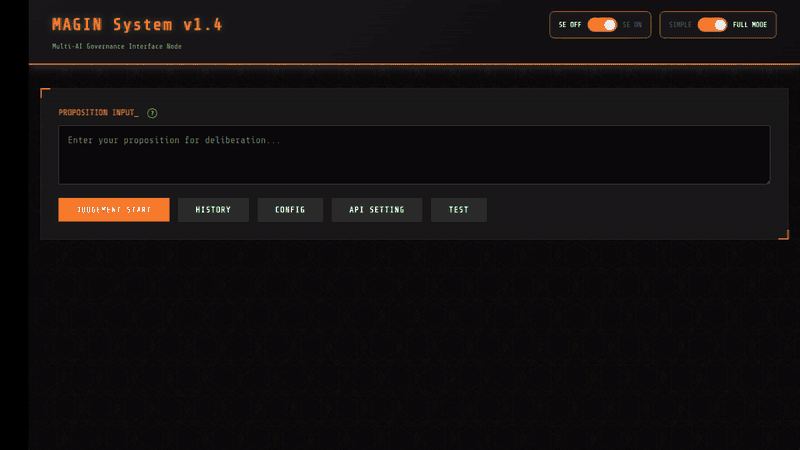

# MAGIN - Multi-AI Governance Interfaces Node

**3つのAIに同時に意見を聞ける意思決定支援ツール**


---

## 🎬 デモ



---

## 📖 何ができるか

MAGINは、**Claude、Gemini、ChatGPTの3つのAIに同時に質問**し、それぞれの判断を比較できるWebアプリケーションです。

### 主な特徴

- **3AI並列判定**: 異なる3つのAI（Claude/Gemini/ChatGPT）が独立して判断
- **意見の可視化**: 各AIの判定結果、重大度スコア、懸念点を一覧表示
- **判定履歴の保存**: 過去の判定をデータベースに保存、後から確認可能

### 判定の仕組み

MAGINは、各AIが 4つの観点（妥当性・実現可能性・リスク・情報確実性）でスコアリングし、重大度に応じた判定テーブルで最終結果を決定します。

**判定フロー**:
1. 各AIが4観点スコアリング
2. ハードフラグチェック（コンプライアンス・セキュリティ・プライバシー）
3. 重大度別判定テーブル適用
4. 最終判定（承認/条件付き承認/否決）

> 📘 **詳細な判定ロジック**: [判定ロジック解説](docs/judgment-logic.md)をご覧ください

### 使用例

- 「週休3日制を導入すべきか？」
- 「新機能Xを実装すべきか？」
- 「予算を増額すべきか？」

---

## 🚀 前提条件･セットアップ

> 以下は2025/10の情報です。最新の正確な情報は公式サイト等から確認してください。

### 必須要件

#### 動作確認済み環境

- **OS**: Ubuntu 24.04 LTS
   - Windows 11(WSL)、MaxOSは動作未確認です（動く可能性はあります）
- **Python**: 3.10以上（開発環境: Python 3.13.5）
- **ブラウザ**: Chrome, Firefox, Edge (最新版推奨)

**AI CLIツール（3つとも必須）**:
- Claude Code
- Gemini CLI
- Codex CLI

**有償プラン契約**:
- **Claude**: Claude Pro、Team、またはAPI課金アカウント
- **Gemini**: 無料利用可能（個人Googleアカウント）
- **ChatGPT**: ChatGPT Plus以上

> ⚠️ **重要**: Claude CodeとCodex CLIは有償プラン契約が必要です。詳細は各サービスの公式サイトで確認してください。

**その他の要件**:
- Python 3.10以上
- Node.js 20以上（Gemini CLI用）

---

### ステップ1: リポジトリのクローン

```bash
git clone https://github.com/yourusername/magin.git
cd magin
```

---

### ステップ2: Python依存パッケージのインストール

```bash
# 仮想環境作成（推奨）
python3 -m venv venv
source venv/bin/activate  # Windows: venv\Scripts\activate

# 依存パッケージインストール
pip install -r requirements.txt
```

---

### ステップ3: AI CLIのインストール

#### Claude Code

```bash
# npm経由
npm install -g @anthropic-ai/claude-code

# macOS/Linux/WSL
curl -fsSL https://claude.ai/install.sh | bash
```

詳細: [Claude Code公式ドキュメント](https://docs.claude.com/en/docs/claude-code/setup)

#### Gemini CLI

```bash
npm install -g @google/gemini-cli
```

詳細: [Gemini CLI GitHub](https://github.com/google-gemini/gemini-cli)

#### Codex CLI

```bash
npm install -g @openai/codex

# または Homebrew (macOS/Linux)
brew install codex
```

詳細: [Codex CLI公式](https://developers.openai.com/codex/cli)

---

### ステップ4: AI CLIの認証

各CLIを起動して、ブラウザでログインします。

```bash
# Claude Code
claude
# → ブラウザが開くので、Claudeアカウントでログイン

# Gemini CLI
gemini
# → Googleアカウントでログイン

# Codex CLI
codex
# → "Sign in with ChatGPT"でログイン
```

---

### ステップ5: アプリケーションの起動

```bash
python3 -m backend.app
```

ブラウザで `http://localhost:8000` にアクセスしてください。

---

## 💡 使い方

1. **議題を入力**
   - テキストエリアに意思決定したい内容を入力

2. **「JUDGEMENT START」をクリック**
   - 3つのAIが並列で判定を開始

3. **結果を確認**
   - 最終判定結果と各AIの詳細を表示
   - AIユニットをクリックすると詳細モーダル表示

4. **履歴を確認**
   - 「HISTORY」ボタンで過去の判定を確認

---

## ⚠️ 注意事項

### AI判定の精度について

- 3つのAIが生成する判定は自動生成されます
- **必ずしも正確な判断とは限りません**
- **最終的な意思決定は必ず人間が行ってください**
- 判定結果はあくまで参考情報としてご利用ください

### コストについて

- Claude Code: Claude Pro/Team/API課金が必要
- Gemini CLI: 個人Googleアカウントで無料利用可能（1日1000リクエストまで）
- Codex CLI: ChatGPT Plus以上が必要

各サービスの利用規約と料金プランは公式サイトでご確認ください。

### 免責事項

このツールの判定結果について、開発者は一切の責任を負いません。

---

## 📁 プロジェクト構造

```
magin/
├── backend/           # バックエンド（FastAPI）
│   ├── app.py         # FastAPIアプリケーション
│   ├── models.py      # データモデル
│   ├── magi_orchestrator.py  # AI並列実行
│   ├── severity_judge.py      # 判定ロジック
│   ├── db_manager.py  # データベース操作
│   └── config.py      # 設定管理
│
├── frontend/          # フロントエンド
│   ├── index.html     # メインUI
│   ├── script.js      # JavaScript
│   ├── style.css      # スタイル
│   └── favicon.ico    # ファビコン
│
├── docs/              # ドキュメント
│   └── judgment-logic.md  # 判定ロジック解説
│
├── img/               # 画像
│   ├── demo.gif
│   └── judgment-flow.png
│
├── requirements.txt   # 依存パッケージ
├── LICENSE            # MITライセンス
└── README.md          # このファイル
```

---

## 🔧 技術スタック

- **Python 3.10+**: プログラミング言語
- **FastAPI**: WebフレームワークとAPI
- **SQLite**: データベース
- **Vanilla JavaScript**: フロントエンド
- **Claude Code**: Anthropic Claude
- **Gemini CLI**: Google Gemini
- **Codex CLI**: OpenAI ChatGPT

---

## 🛠️ トラブルシューティング

### Python 3.10がインストールされていない

**Ubuntu/Debian**:
```bash
sudo apt update
sudo apt install python3.10 python3.10-venv python3-pip
```

**macOS (Homebrew)**:
```bash
brew install python@3.10
```

**Windows**: [Python公式サイト](https://www.python.org/downloads/)からダウンロード

### Node.js 20がインストールされていない

**nvm使用（推奨）**:
```bash
nvm install 20
nvm use 20
```

**公式サイト**: [Node.js公式](https://nodejs.org/)

### ポート8000が使用中

別のポートで起動:
```bash
uvicorn backend.app:app --host 0.0.0.0 --port 8001
```

### AI CLIが認証できない

各CLIを単体で起動して、ブラウザログインが完了しているか確認:
```bash
claude  # Claudeログイン確認
gemini  # Geminiログイン確認
codex   # Codexログイン確認
```

---

## 📄 ライセンス

このプロジェクトはMITライセンスで公開されています。
詳細は [LICENSE](LICENSE) ファイルを参照してください。

---

## 📞 質問・不具合報告

[Issues](https://github.com/yourusername/magin/issues) まで

---

**更新日**: 2025-10-05
**バージョン**: 1.0.0
