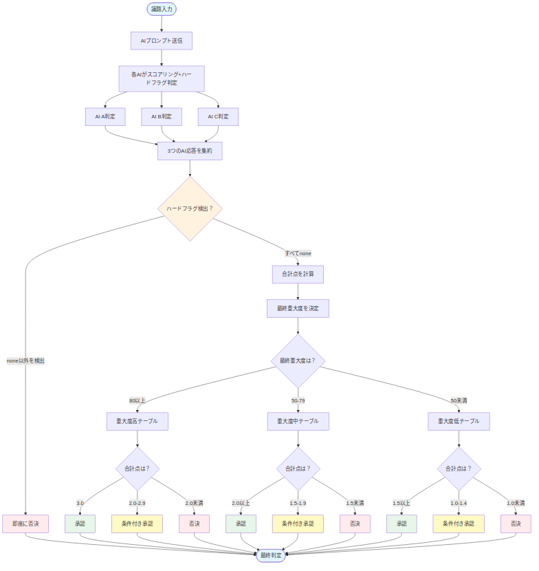

# MAGINの判定ロジック

**3つのAI判定からどのように判断を下すのか？**

MAGINは、Claude・Gemini・ChatGPTの3つのAIに同時に意見を聞き、その結果を集約して最終判定を行います。このドキュメントでは、MAGINがどのように判断を下すのか、その仕組みを解説します。

---

## 📊 判定の全体フロー



---

## 🎯 4観点スコアリング（4-ASPECT SCORES）

各AIは、ペルソナに応じたプロンプト指示に基づき、議題を以下の4つの観点から0.0〜1.0でスコアリングします。

### 1. VALIDITY（妥当性）
**提案が目的に対して整合しているか**

- **1.0**: 完全に整合している
- **0.5**: 部分的に整合している
- **0.0**: 全く整合していない

### 2. FEASIBILITY（実現可能性）
**実行するためのリソース・条件を将来的に整えられる可能性は高いか**

- **1.0**: 実現への道筋が明確で、必要なリソース確保の確度が高い
- **0.5**: いくつかの課題はあるが、解決可能でリソース確保の見込みがある
- **0.0**: 乗り越えるべき課題が多く、リソース確保の見通しが立たない

### 3. RISK（リスク）
**安全性・倫理・コストの観点でリスクが許容範囲内か**

- **1.0**: リスクは極めて小さい、または完全に管理可能である
- **0.5**: いくつか懸念点があるが、対策を講じることで許容可能である
- **0.0**: 致命的、あるいは許容できないリスクが存在する

### 4. CERTAINTY（情報確実性）
**意思決定を下すために十分な判断根拠や情報を、将来的に得られる見込みは高いか**

- **1.0**: 現時点で十分な情報がある、または容易に追加情報を得られる
- **0.5**: 情報は不完全だが、調査や議論を進めることで判断材料は揃う見込み
- **0.0**: 前提となる情報が不明確で、判断材料を得る見込みが低い

---

## 📈 各AIの判定（DECISION）

各AIは、4観点の平均スコアと、**自身のペルソナに与えられた独自の判定ルール**に基づいて、「承認」「部分的承認」「否決」のいずれかの判定を下します。

### ⚠️ AI個人の判定ルール（ペルソナへの移譲）

判定ルールは、プロンプトのペルソナ定義（可変部分）で個別に設定されます。

- **（例）官僚ペルソナへの指示**: `riskスコアが0.6未満の議題を「承認」することは絶対にありません。`
- **（例）起業家ペルソナへの指示**: `たとえriskスコアが低くとも、他のスコアが高ければ、あなたはそれをチャンスと捉え「承認」と判定することができます。`

これにより、ペルソナの性格がAI個人の判定に色濃く反映されます。

---

## 🔢 SEVERITY SCORE（重大度）

各AIは、議題の重大度を0〜100のスコアで評価します。

| スコア範囲 | 意味 | 例 |
|-----------|------|---|
| **0-20** | 個人的 | チャットルーム名の変更 |
| **21-40** | 組織的 | 部署内の予算配分 |
| **41-60** | 社会的 | 地域のイベント開催 |
| **61-80** | 国家的 | 法律の改正 |
| **81-100** | 存亡級 | 国家安全保障に関わる決定 |

### 最終重大度の決定

3つのAIが算出した重大度スコアのうち、**最も高い数値**を「最終重大度」として採用します。

```
最終重大度 = max(AI A重大度, AI B重大度, AI C重大度)
```

この最終重大度の値に基づき、最終判定に用いるテーブルを決定します。

---

## 🚨 ハードフラグ（HARD FLAG）

AIがプロンプトの指示に基づき「致命的な懸念」を検出した場合、ハードフラグを設定します。

| フラグ | 意味 | 例 |
|-------|------|---|
| **compliance** | コンプライアンス違反 | 法令に明確に抵触 |
| **security** | セキュリティリスク | 重大なセキュリティ脆弱性 |
| **privacy** | プライバシー侵害 | 個人情報漏洩の懸念 |
| **none** | 懸念なし | 通常状態 |

### ハードフラグの最優先ルール

**AIのうち1つでもハードフラグ（`"none"`以外）を検出した場合、他のすべてのロジックを中断し、即座に最終判定を「否決」とします。**

ペルソナによる判断の差は、プロンプト側で「このペルソナはフラグを出すか、出さないか」を制御することで実現します。

---

## ⚖️ 最終判定のロジック

### ステップ1: ハードフラグチェック

3つのAIの応答をチェックし、1つでもハードフラグが立っていれば**即座に「否決」**。

### ステップ2: 合計点の計算

ハードフラグがない場合、各AIの判定を点数化し、合計点を算出します。

| 判定 | 点数 |
|------|------|
| 承認 | 1.0点 |
| 部分的承認 | 0.5点 |
| 否決 | 0.0点 |

**例**: Claude「承認(1.0)」+ Gemini「承認(1.0)」+ ChatGPT「部分的承認(0.5)」 = **2.5点**

### ステップ3: 重大度別判定テーブル適用

「最終重大度」に応じて、異なる基準の判定テーブルを適用し、最終判定を下します。

#### 🔴 重大度: HIGH（最終重大度 >= 80）

**全員一致に近い、極めて慎重な判断**

| 合計点 | 最終判定 | 説明 |
|--------|----------|------|
| **3.0** | 承認 | 全員一致で承認 |
| **2.0以上3.0未満** | 条件付き承認 | 2承認 + 1部分的承認 |
| **2.0未満** | 否決 | 全員一致の要件を満たさない |

#### 🟡 重大度: MID（50 <= 最終重大度 < 80）

**過半数を重視する、バランスの取れた判断**

| 合計点 | 最終判定 | 説明 |
|--------|----------|------|
| **2.0以上** | 承認 | 過半数が承認 |
| **1.5以上2.0未満** | 条件付き承認 | 1承認 + 部分的承認混在 |
| **1.5未満** | 否決 | 過半数の要件を満たさない |

#### 🟢 重大度: LOW（最終重大度 < 50）

**多様な意見を許容する、柔軟な判断**

| 合計点 | 最終判定 | 説明 |
|--------|----------|------|
| **1.5以上** | 承認 | 過半数が承認 |
| **1.0以上1.5未満** | 条件付き承認 | 1承認または部分的承認混在 |
| **1.0未満** | 否決 | 承認が不足 |

---

## 💡 具体例

### 例1: 重大度高 + ハードフラグなし

**議題**: 「新規サービスを即時全社展開する」

**AI応答**:

| AI | VALIDITY | FEASIBILITY | RISK | CERTAINTY | 平均 | DECISION | SEVERITY |
|----|----------|-------------|------|-----------|------|----------|----------|
| Claude | 0.9 | 0.8 | 0.7 | 0.8 | 0.80 | 部分的承認 | 85 |
| Gemini | 0.85 | 0.85 | 0.6 | 0.75 | 0.76 | 部分的承認 | 82 |
| ChatGPT | 0.8 | 0.9 | 0.65 | 0.85 | 0.80 | 部分的承認 | 88 |

**判定プロセス**:
1. ハードフラグ: なし
2. 最終重大度: max(85, 82, 88) = **88** → HIGH
3. 合計点: 0.5 + 0.5 + 0.5 = **1.5点**
4. テーブル適用（重大度HIGH）: 1.5 < 2.0 → **否決**

**最終判定**: **否決**（合計点1.5/3.0。HIGH重大度では2.0以上が必要）

---

### 例2: 重大度中 + ハードフラグあり

**議題**: 「個人情報を含むログファイルを外部サーバーに保存する」

**AI応答**:

| AI | VALIDITY | FEASIBILITY | RISK | CERTAINTY | 平均 | DECISION | SEVERITY | HARD FLAG |
|----|----------|-------------|------|-----------|------|----------|----------|-----------|
| Claude | 0.7 | 0.9 | 0.4 | 0.6 | 0.65 | 否決 | 65 | **privacy** |
| Gemini | 0.75 | 0.85 | 0.5 | 0.7 | 0.70 | 部分的承認 | 62 | none |
| ChatGPT | 0.8 | 0.9 | 0.45 | 0.65 | 0.70 | 部分的承認 | 68 | none |

**判定プロセス**:
1. **ハードフラグ検出**: Claudeが"privacy"を設定
2. **ハードフラグ最優先ルール適用** → 即座に**否決**

**最終判定**: **否決**（ハードフラグ検出: privacyにより自動否決）

---

### 例3: 重大度低 + ハードフラグなし

**議題**: 「チーム内のSlackチャンネル名を変更する」

**AI応答**:

| AI | VALIDITY | FEASIBILITY | RISK | CERTAINTY | 平均 | DECISION | SEVERITY |
|----|----------|-------------|------|-----------|------|----------|----------|
| Claude | 0.95 | 1.0 | 0.95 | 0.9 | 0.95 | 承認 | 15 |
| Gemini | 0.9 | 1.0 | 0.9 | 0.85 | 0.91 | 承認 | 12 |
| ChatGPT | 0.85 | 0.95 | 0.85 | 0.8 | 0.86 | 部分的承認 | 18 |

**判定プロセス**:
1. ハードフラグ: なし
2. 最終重大度: max(15, 12, 18) = **18** → LOW
3. 合計点: 1.0 + 1.0 + 0.5 = **2.5点**
4. テーブル適用（重大度LOW）: 2.5 >= 1.5 → **承認**

**最終判定**: **承認**（合計点2.5/3.0。LOW重大度では1.5以上で承認）

---

## 🔍 判定ロジックのポイント

### 1. 多層的な判断

MAGINは単純な多数決ではなく、以下の要素を組み合わせて判定します。

- **4観点スコア**: 多角的な評価
- **ハードフラグ**: 致命的な懸念の検出
- **重大度**: 議題の影響範囲
- **合計点**: 3つのAIの総意

### 2. 安全性重視

- **ハードフラグ最優先**: コンプライアンス・セキュリティ・プライバシーの問題は即座に否決
- **重大度別テーブル**: 重大な議題ほど高いハードルを設定

### 3. ペルソナによる多様性

- **ペルソナ定義**: 各AIが異なる性格・価値観で判断
- **判定ルールの個別化**: リスク許容度などをペルソナごとにカスタマイズ

### 4. 透明性

- 各AIの判断根拠（REASONING）を表示
- 4観点スコアで「なぜその判定になったか」を可視化
- 懸念点（CONCERNS）をリスト表示

---

## ⚠️ 注意事項

### AIの限界

- AIは自動生成された判断を提供しますが、**必ずしも正確ではありません**
- 最終的な意思決定は**必ず人間が行ってください**
- MAGINの判定結果は、あくまで**参考情報**としてご利用ください

### 判定の妥当性

- ハードフラグの検出精度は100%ではありません
- 重大度の評価は、AIの学習データや前提に依存します
- 複雑な議題では、AIの判断が分かれることがあります

---
